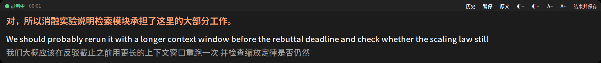
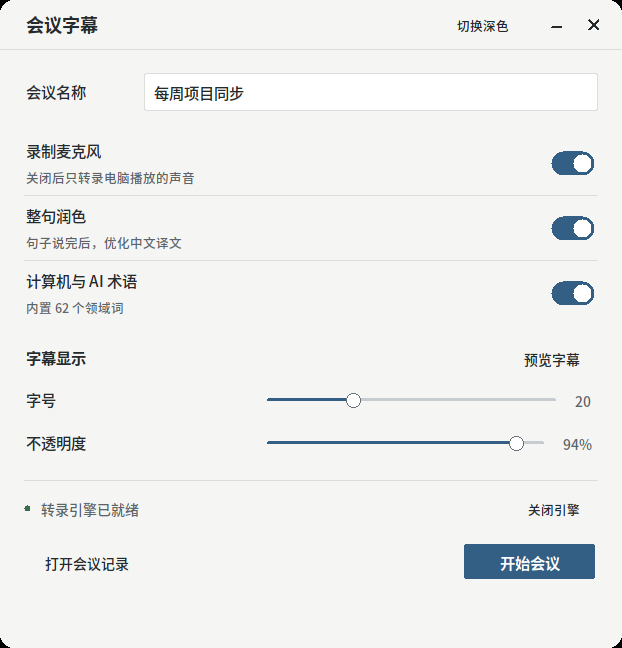
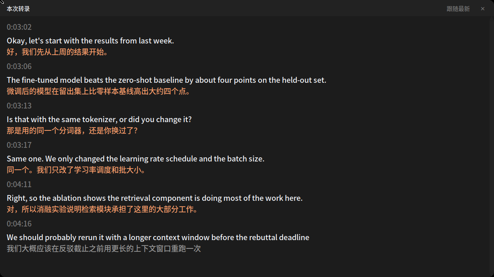

# Meeting Subtitles

**Real-time English → Chinese subtitles for any meeting, running entirely on your own GPU.**

[简体中文](README.zh-CN.md) · [Design notes](docs/design-notes.zh-CN.md)

A floating bar sits at the bottom of your screen. The top line is the finished
Chinese translation of the sentence that just ended; below it the English runs
live, with a rough Chinese draft under that. Nothing is sent anywhere — no API
keys, no accounts, no network after the models are cached.



Built for a specific situation: you are a non-native English speaker in
meetings with international colleagues, some with strong accents, and you want
to follow along *and* keep a transcript. It transcribes English speech and
translates it to Chinese.

---

## Why this instead of the built-in captions

|  | Zoom / Teams captions | This |
|---|---|---|
| Where the audio goes | a vendor's servers | nowhere |
| Chinese translation | often unavailable or paid | always, locally |
| Works with | that one app | anything the machine plays |
| Transcript | per-vendor, sometimes paywalled | a Markdown file you own |
| Domain terminology | generic | a glossary you control |

Because it captures the audio your **speakers** are playing rather than hooking
into a specific program, it works with Zoom, Teams, Meet, a browser tab, a
local video file, or anything else — no plugin and no permission from the app
producing the sound.

## How it works

```
system audio (what the others say) ┐
                                   ├─ ffmpeg mix → 16 kHz mono PCM
microphone (what you say)          ┘        │
                                            ▼
                       WhisperLiveKit  ── ws://127.0.0.1:8000/asr
                       Whisper large-v3  →  English text, streamed
                       NLLB-1.3B         →  Chinese draft, streamed
                                            │
                                            ▼
                       Qwen3-4B  → whole-sentence Chinese, once a sentence ends
                                            │
                     ┌──────────────────────┴──────────────────────┐
                     ▼                                             ▼
              floating subtitle bar                        transcript.md
```

**Two-tier translation** is the part that makes it readable. A streaming
translator has to commit to words before the sentence is over, so it produces
something word-by-word and awkward. That draft still shows — in grey, so you
have *something* immediately — but the moment a sentence ends, a local
instruct model retranslates it whole and pins the result on top in orange.
Draft latency is around a second; a refined sentence lands 0.1–0.4 s after the
speaker stops.

## What you need

| | |
|---|---|
| OS | Linux with PulseAudio or PipeWire. Tested on Ubuntu 24.04 (GNOME, Wayland via XWayland). |
| GPU | NVIDIA, **~22 GB VRAM** with sentence refinement on, **~14 GB** with `--no-refine`. |
| Disk | ~18 GB of models, downloaded once. |
| Python | 3.11 or newer, with `python3-tk`. |

No GPU, or a small one? It will run on CPU, but not in real time. This is not
the tool for that.

## Install

```bash
git clone https://github.com/cxh42/meeting-subtitles
cd meeting-subtitles
./install.sh
```

`install.sh` checks the system packages it needs (and prints the one `apt`
command to run if any are missing), creates a virtualenv, installs everything,
registers a desktop entry, and finishes by running the environment check.

Run that check any time — after a system upgrade, or when something stops
working:

```bash
.venv/bin/meeting-subtitles-doctor
```

It reports on Python, ffmpeg, the audio server, the monitor source, CUDA,
fonts, the display server and the model cache separately, so a failure points
at one thing to fix.

## Use



Search for **会议字幕 / Meeting Subtitles** in your application list, or run
`.venv/bin/meeting-subtitles`.

1. Name the meeting; set the subtitle size and opacity to taste.
2. The engine loads on first use (20–40 s once models are cached). **Start**
   lights up when it is ready.
3. The launcher hides, the subtitle bar appears.
4. Press **结束并保存 / End** on the bar when the meeting is over.

Everything lands in `~/Meetings/<date>_<name>/`: `transcript.md`, written
atomically every 3 seconds, and `audio.wav` so you can re-transcribe later.

Press **历史 / History** on the bar for the full transcript so far. Scrolling
up freezes it — new sentences stop pushing the text you are reading — and a
button appears to jump back to the live end.



### From the command line

```bash
.venv/bin/meeting-subtitles-engine          # start the engine, keep it running
.venv/bin/meeting-subtitles-run --help      # one session, without the GUI
```

Useful options:

```bash
--context "Kubernetes, Anirudh, SLO"   # terms and names for this meeting
--no-mic                               # transcribe only the other side
--no-refine                            # skip sentence refinement, save ~8 GB
--no-overlay                           # record a transcript, show no window
--domain general                       # drop the built-in CS/AI glossary
--font-size 24 --opacity 0.8
```

### Domain terminology

The default preset is **CS / AI research**: 62 terms that get fed to the
recogniser so acronyms survive (LoRA, RLHF, vLLM, KV cache, NeurIPS, FLOPs),
plus Chinese conventions for the refiner, so `ablation study` comes out as
消融实验 rather than something literal. Turn it off with `--domain general`, or
edit `meeting_subtitles/domain.py` to add your own field.

## Model licenses

The code here is Apache-2.0. The models it downloads are not all as permissive,
and one is worth knowing about before you use this at work:

| Model | License |
|---|---|
| Whisper large-v3 | MIT |
| faster-whisper large-v3 | MIT |
| **NLLB-200-distilled-1.3B** | **CC-BY-NC-4.0 — non-commercial only** |
| Qwen3-4B-Instruct-2507 | Apache-2.0 |

NLLB is the streaming translator. If you need commercial use, replace it with a
different translation backend (see `whisperlivekit --help`), or run with
`--target-language ""` and rely on the refiner alone.

## Backing up the models

18 GB is slow to fetch twice, especially if `huggingface.co` is unreliable
where you are. Before wiping a disk:

```bash
.venv/bin/python tools/models.py status
.venv/bin/python tools/models.py backup --to /mnt/backup/meeting-models
```

and afterwards:

```bash
.venv/bin/python tools/models.py restore --from /mnt/backup/meeting-models
```

## Known limits

- **Linux only.** macOS would need a virtual audio device such as BlackHole;
  Windows would need a WASAPI loopback backend. Neither is implemented.
- **English in, Chinese out.** The source language is pinned to English on
  purpose — letting Whisper auto-detect costs noticeable accuracy on accented
  speech, which is exactly the case this exists for.
- **One mixed stream**, so the transcript does not say who spoke. Start the
  engine with `--diarization` if you need that.
- Whisper occasionally hallucinates a short phrase during long silences. Real
  meetings have enough room tone that this is rarer than it is on digital
  silence.

## Changing the code

Start with [AGENTS.md](AGENTS.md) — build commands, architecture, and the
traps that cost real time here. Every AI coding agent reads it too; Claude
Code picks it up through `CLAUDE.md`.

## Credits

The transcription engine is [WhisperLiveKit](https://github.com/QuentinFuxa/WhisperLiveKit)
by Quentin Fuxa (Apache-2.0), which this project installs as a dependency and
drives — no engine source is copied here. It in turn builds on SimulStreaming
and whisper_streaming (ÚFAL), silero-vad (snakers4) and NeMo (NVIDIA). See
[NOTICE](NOTICE).

Licensed under Apache-2.0. See [LICENSE](LICENSE).
