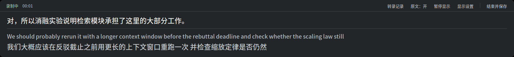
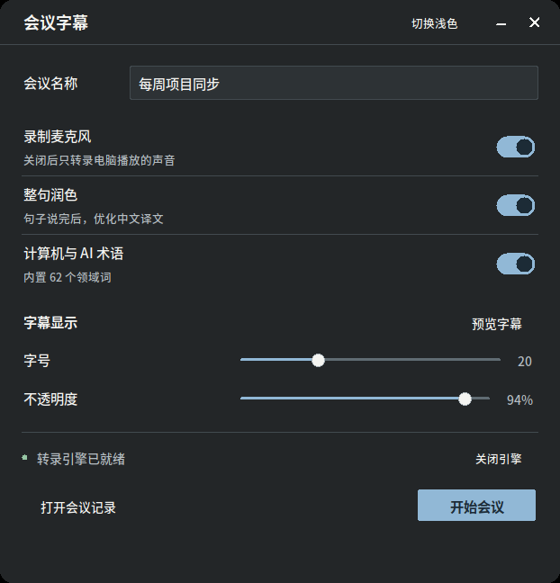
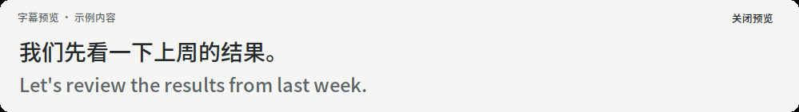

# 会议字幕

在 Linux 桌面上显示实时中英对照字幕，并保存会议录音与转录。默认使用本机模型识别英文、翻译为中文，无需云端 API。

[English](README.md) · [设计笔记](docs/design-notes.zh-CN.md)



工具采集电脑正在播放的声音，也可以同时录制麦克风。因此，会议软件、浏览器和本地播放器都能使用，无需安装各自的插件。模型需要先下载；缓存齐全后，默认本地配置可离线运行，音频与转录保存在本机。界面目前为简体中文。

## 主要功能

- **实时字幕与整句润色。** 英文原文和中文草稿随识别结果更新；启用润色后，句子结束时再由本地模型重新翻译，显示在字幕条上方。
- **可记忆的深浅外观。** 启动器标题栏可切换深色或浅色，下次打开时恢复上次选择。字幕预览、字幕条和转录记录使用同一外观。
- **开始前预览。** 在紧凑的启动器中设置麦克风、整句润色和领域术语，点击「预览字幕」即可在屏幕底部查看字号与不透明度效果。
- **会议中随时回看。** 打开「转录记录」查看、选中和复制文本。向上滚动时保持当前位置，点击「回到最新」恢复跟随。
- **本地保存。** 默认保存 Markdown 转录和 WAV 录音；命令行还可选择 SRT、JSON 格式。
- **领域术语提示。** 内置计算机与 AI 术语表，也可通过命令行补充会议中的人名、产品名和缩写。

## 运行环境

| 项目 | 要求或参考配置 |
|---|---|
| 系统 | Linux，使用 PulseAudio 或 PipeWire 的 PulseAudio 兼容服务；已在 Ubuntu 24.04 / GNOME 上测试 |
| 桌面 | X11，或通过 XWayland 运行的 Wayland 桌面 |
| 显卡 | 默认配置面向 NVIDIA CUDA 显卡；开启整句润色约需 22 GB 显存，关闭后约 14 GB |
| 磁盘 | 默认模型缓存约 18–20 GB，另需为 Python 依赖和会议录音预留空间 |
| Python | 3.11 及以上，需安装系统 Tk 和中文字体 |

上述容量是默认模型配置的参考值，实际占用和字幕延迟取决于模型、运行库、硬件及音频内容。完整默认配置依赖 CUDA，不适合作为 CPU 实时转录方案。

## 安装

```bash
git clone https://github.com/cxh42/meeting-subtitles
cd meeting-subtitles
./install.sh
```

安装脚本会检查系统依赖、创建虚拟环境、安装 Python 依赖并注册桌面入口。缺少系统包时，它会给出需要运行的安装命令；最后执行环境自检。

首次启动引擎时会下载缺少的 Whisper 和 NLLB 模型。如果要使用「整句润色」，还需提前下载 Qwen 模型，或从已有备份恢复：

```bash
HF_HUB_OFFLINE=0 .venv/bin/python -c "from huggingface_hub import snapshot_download; snapshot_download('Qwen/Qwen3-4B-Instruct-2507')"
```

不需要整句润色时，可跳过 Qwen 下载，并在启动器中关闭「整句润色」。润色模型从本地缓存加载；缺少缓存或加载失败时，会退回流式中文译文。

模型下载需要访问 Hugging Face。桌面入口所需的代理配置可写入 `~/.config/meeting-subtitles/env`，例如 `https_proxy=http://127.0.0.1:7897`；设置了 `XDG_CONFIG_HOME` 时，配置目录随之调整。

遇到启动、音频或模型加载问题，先运行：

```bash
.venv/bin/meeting-subtitles-doctor
```

自检会检查 Python、ffmpeg、音频服务、CUDA、中文字体、显示环境和模型缓存，并给出对应的修复建议。

## 使用

在应用列表中搜索「会议字幕」，或在项目目录运行：

```bash
.venv/bin/meeting-subtitles
```

| 浅色模式 | 深色模式 |
|---|---|
|  |  |

1. 填写会议名称，按需启用「录制麦克风」「整句润色」和「计算机与 AI 术语」。关闭麦克风后，只采集电脑播放的声音。
2. 点击标题栏的「切换深色」或「切换浅色」选择外观。选择立即保存，下次启动继续使用。
3. 调整字号和不透明度，点击「预览字幕」查看屏幕底部的示例。预览不录音，调整设置时会同步更新。
4. 等待转录引擎就绪，点击「开始会议」。启动器随后隐藏，字幕条出现。
5. 会议结束时，点击字幕条上的「结束并保存」，等待最后的转录写入完成。



字幕条从上到下显示最近一句润色后的中文译文、实时英文原文和中文草稿。尚无润色结果或关闭润色时，只显示实时内容。「原文：开」可控制英文显示，「显示设置」可在会议中调整字号和不透明度。点击「暂停显示」只会冻结字幕画面，音频采集、识别和保存仍会继续；点击「继续显示」恢复画面更新。

「转录记录」按时间列出当前会议的中英文本，支持选中复制。向上滚动阅读时，新内容不会改变当前阅读位置；「回到最新」可恢复自动跟随。


文件默认保存在 `~/Meetings/<日期与时间>_<会议名称>/`：

- `transcript.md`：中英对照转录，在会议期间定期保存，结束时完成最后写入。
- `audio.wav`：本场会议采集的音频，可供回听或重新转录。

启动器中的「打开会议记录」可打开保存目录。会议结束后，引擎会继续待命；暂时不用时，可在启动器中点击「关闭引擎」释放显存。

## 命令行

先在一个终端启动引擎，并保持运行：

```bash
.venv/bin/meeting-subtitles-engine
```

引擎就绪后，在另一个终端开始会议。以下命令默认仍会显示字幕窗口：

```bash
.venv/bin/meeting-subtitles-run --title "项目周会"
```

只记录、不显示窗口时，使用 `--no-overlay`；按 `Ctrl+C` 结束并保存：

```bash
.venv/bin/meeting-subtitles-run --title "项目周会" --no-overlay
```

查看全部参数或列出可用音频源：

```bash
.venv/bin/meeting-subtitles-run --help
.venv/bin/meeting-subtitles-run --list-devices
```

常用参数可组合使用：

| 参数 | 作用 |
|---|---|
| `--context "Kubernetes, Anirudh, SLO"` | 补充本次会议的术语和人名 |
| `--no-mic` | 只采集系统声音 |
| `--no-refine` | 关闭整句润色，降低显存占用 |
| `--domain general` | 停用内置计算机与 AI 术语表 |
| `--font-size 24 --opacity 0.8` | 设置字幕字号和不透明度 |
| `--theme dark` / `--theme light` | 指定本次字幕外观，不改动已保存的偏好；不指定时沿用上次选择 |
| `--formats md,srt,json` | 同时保存三种转录格式 |
| `--no-audio-file` | 保存转录，但不写入 WAV 录音 |

### 领域术语

默认的 `cs-ai` 预设包含 62 个术语，如 LoRA、RLHF、vLLM、KV cache 和 NeurIPS。它为语音识别提供提示，并为整句润色补充中文术语用法，例如将 `ablation study` 译为「消融实验」。这些提示有助于保持术语一致，但不能保证每次识别和翻译都正确。

普通会议可在启动器关闭「计算机与 AI 术语」，或传入 `--domain general`。`--context` 可在当前预设基础上添加术语；如需维护其他领域的完整预设，可修改 [`meeting_subtitles/domain.py`](meeting_subtitles/domain.py)。

## 备份模型

更换磁盘或重装系统前，可检查缓存并备份模型，避免重复下载：

```bash
.venv/bin/python tools/models.py status
.venv/bin/python tools/models.py backup --to /mnt/backup/meeting-models
```

重新安装项目后，恢复到本机模型缓存：

```bash
.venv/bin/python tools/models.py restore --from /mnt/backup/meeting-models
```

## 已知限制

- 目前只支持 Linux，尚未实现 macOS 和 Windows 音频采集后端。
- 默认流程针对英文识别和中文翻译设计，其他语言组合未经同等验证。
- 系统声音和麦克风混为一路音频，默认配置不区分说话人。
- 口音、背景噪声、多人同时说话及长时间静音都可能影响结果；识别与翻译内容需要结合实际语境核对。
- 整句润色需要等待句子结束，模型首次加载和显卡负载较高时也会增加延迟。
- 不透明度作用于整个字幕窗口，包括文字；调得过低可能影响阅读。

## 模型许可证

项目代码采用 Apache-2.0 许可证，下载的模型分别遵循各自的许可证：

| 模型 | 许可证 |
|---|---|
| [Whisper large-v3](https://github.com/openai/whisper) | [MIT](https://github.com/openai/whisper/blob/main/LICENSE) |
| [faster-whisper large-v3](https://huggingface.co/Systran/faster-whisper-large-v3) | MIT |
| [NLLB-200-distilled-1.3B](https://huggingface.co/facebook/nllb-200-distilled-1.3B) | CC-BY-NC-4.0（非商业许可） |
| [Qwen3-4B-Instruct-2507](https://huggingface.co/Qwen/Qwen3-4B-Instruct-2507) | Apache-2.0 |

默认翻译流程使用 NLLB，其非商业许可与本项目代码的许可证不同。使用前请查阅相应模型的许可条款，尤其是商业用途的适用条件。

## 开发与致谢

开发前请阅读 [AGENTS.md](AGENTS.md)，其中包含架构约定、验证命令和已知陷阱。实现背景见[设计笔记](docs/design-notes.zh-CN.md)，界面规范见 [DESIGN.md](DESIGN.md)。

转录引擎使用 Quentin Fuxa 的 [WhisperLiveKit](https://github.com/QuentinFuxa/WhisperLiveKit)，以依赖方式安装。感谢 WhisperLiveKit 及其上游项目 SimulStreaming、whisper_streaming、silero-vad 和 NeMo。第三方声明见 [NOTICE](NOTICE)，项目许可证见 [LICENSE](LICENSE)。
